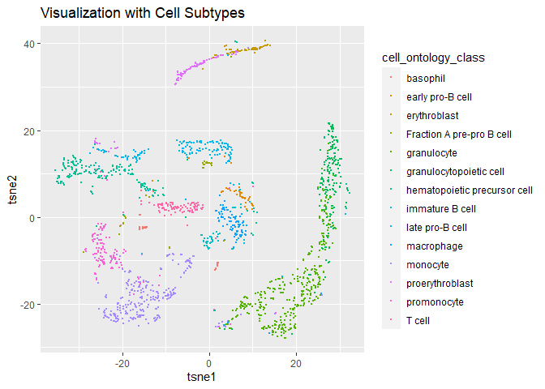

<!-- README.md is generated from README.Rmd. Please edit that file -->

# scRAS

<!-- badges: start -->
<!-- badges: end -->

The goal of scRAS is to measure the cell state deviation (CSD) and cell
anomalousness score (CAS) which are indicators of whether one individual
cell is remote from the average expression states and whether a cell is
locally anomalous, respectively.

## Installation

You can install the development version of scRAS like so:

``` r
if(!require(devtools)) install.packages("devtools")
library(devtools)
devtools::install_github("AristoQian/scRAS")
```

The usage of scRAS will be demonstrated as follow:

## Obtaining Feature Matrix

Here we call the R functions to calculate the top 25 PCs:

``` r
library(scRAS)
data(marrow)
data(cell.type.marrow)
pc<-prcomp(t(marrow))
feature <- pc$x[,1:25]
```

## Computing the CSDs and CASs

We call the scores() function to compute the CSDs and CASs:

``` r
scores<-scores(feature.mat = feature)
#> [1] "Constructing affinity matrix"
#> [1] "Computing the cell state deviations considering the distances from majority cells"
#> [1] "Computing anomalous scores"
```

## Visualizing the CSDs and CASs

``` r
library(cowplot)
library(ggplot2)
plts<-visualize(feature.mat = feature, scores = scores, cell.labels = cell.type.marrow)
plts$plt.label+ggtitle("Visualization with Cell Subtypes")
```

 The
visualization of CSDs and CASs

``` r
plot_grid(plts$plt.CSD, plts$plt.CAS, labels=c("CSD","CAS"),nrow = 2)
```


